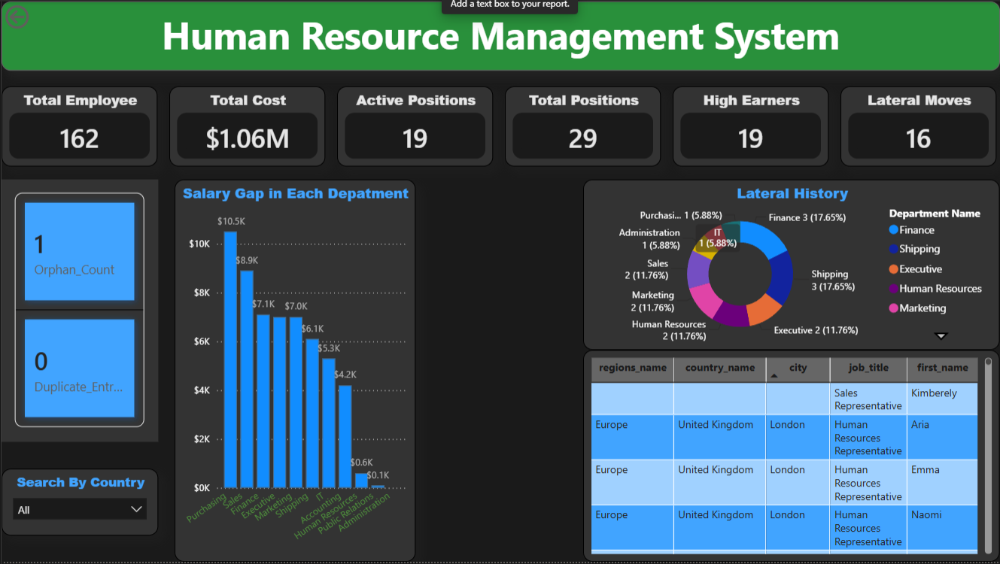

# End-to-End HR Management System: SQL Data Audit & Power BI Analytics

An enterprise-grade, end-to-end data analytics solution that implements an HR Management System. This project combines robust **SQL Database Design & Defensive Data Auditing** with a high-performance **Power BI Executive Dashboard** to monitor workforce metrics, optimize salary structures, track internal mobility, and proactively enforce data governance.

---

## 🚀 Key Dashboard Interface

*(A premium dark-themed executive control center built with custom DAX optimization patterns)*

---

## 🛠️ Project Architecture & Workflow
1. **Data Layer (SQL Server/MySQL):** Implements schemas tracking core employee distributions, regional offices, job levels, and historical structural career logs.
2. **Data Integrity & Auditing Layer (SQL & DAX):** Leverages proactive data validation to flag system errors, duplicate records, or unmatched structural anomalies.
3. **Analytics & Visualization Layer (Power BI):** Translates millions of row-level entries into actionable strategic indicators using advanced semantic modeling.

---

## 📊 Core Analytical Features & DAX Implementation

### 1. Corporate Strategy Metrics
* **Total Headcount & Cost:** Instantly summarizes active workforce volume ($162$) alongside operational salary liabilities ($1.06M$).
* **Salary Gap Identification:** A dynamic column visual mapping operational pay parity discrepancies sorted by department to prevent corporate friction.

### 2. Talent Mobility Tracking
* **Lateral History Analysis:** Features a dedicated Donut Chart visual dissecting career transfers vs static tenure tracking out of the historical logs.
* **Active vs. Total Positions:** Monitors internal structural capacity ($19$ Active vs. $29$ Total Positions) to guide talent acquisition logic.

### 3. Automated Data Governance (Defensive Analytics)
* **Duplicate Profile Tracker:** A custom health indicator built to alert HR operations if structural redundancies slip past the database layer:
  ```dax
  Duplicate_Count = COUNTROWS(employees) - DISTINCTCOUNT(employees[employee_id])

## SQL Data Audit
### 🛠️ Module 1: Payroll Compliance & Budgetary Controls

### A. The Multi-Metric Departmental Variance Report
* **The Business Problem:** HR executives need an objective financial health check to isolate departments running heavy financial operations. Simple averages mask real payroll stratification. Management requires a single report showing headcount density, total structural payroll drag, and the operational "Pay Spread" (the range variance between the lowest and highest earner) to pinpoint unequal distribution.
* **The Technical Solution:**
* **HR Data Insight:** This filters out tiny outlier teams and dynamically categorizes major operating segments. The Salary_Gap surfaces structural disparities, while the High_Earner_Count measures heavy top-tier compensation density against the total department budget status.

### B. The Departmental Distance Audit (Window Functions)
* **The Business Problem:** During internal salary reviews, standard aggregation drops the individual employee's identity. HR needs to analyze equity at an individual contributor level, specifically asking: "How far above or below their exact department average does this specific employee sit?"
* **The Technical Solution:**
* **HR Data Insight:** By leveraging the OVER(PARTITION BY...) window function, we keep the granular employee record visible while calculating contextual running metrics. A negative Dept_Distance highlights flight-risk personnel under the department mean, while high positive variances flag potential internal compensation anomalies.

### C. The Competitive Market Budget Share Analyzer
* **The Business Problem:** High earners (salaries > $8,000) drive the largest chunk of corporate liability. HR needs a relative weight report showing what precise percentage of a department's overall budget a single elite earner consumes, alongside their distance from the absolute top cap in the firm.
* **The Technical Solution:**
* **HR Data Insight:** This query processes a derived table summary first, then joins back to individual entries. It actively flags structural financial risk—such as a single employee consuming an asymmetric share (e.g., >30%) of a department's entire monthly compensation pool.
  
---

### 🔄 Module 2: Relational Integrity & Talent Mobility

### A. The Global Cross-Schema 7-Table Join
* **The Business Problem:** For enterprise global tracking, data must span geography and job classifications. HR requires an unified global ledger mapping employees across their structural paths (Jobs, Departments, Locations, Countries, and Regions) while tagging whether they are static hires or internal veterans.
* **The Technical Solution:**
* **HR Data Insight:** This query handles a complex cascading join hierarchy. The optimization twist utilizes WHERE EXISTS as an efficient semi-join check against historical logs, flagging employee operational maturity without causing the query engine to balloon processing times.

### B. The Multi-Path Lateral Movement Tracker
* **The Business Problem:** When auditing retention or talent rotation pathways, HR needs to pinpoint internal career shifts. Specifically, we want to isolate and contrast personnel who have actively changed units where their current department explicitly differs from their prior documented assignment.
* **The Technical Solution:**
* **HR Data Insight:** This requires aliasing the departments lookup table twice (d_curr and d_prev). It ignores static histories and isolates lateral transfers, providing clear documentation on inter-departmental mobility trends.
---

### 🛡️ Module 3: Data Cleansing, Governance & Core Automation

### A. Structural Integrity Boundary Auditing (Orphan & Ghost Identification)
* **The Business Problem:** System sync errors frequently create critical structural breakdowns. This includes "Orphan Employees" (assigned to non-existent department keys) or "Ghost Departments" (referencing invalid IDs). Standard inner joins drop these completely, masking systemic data degradation from compliance inspectors.
* **The Technical Solution:**
* **HR Data Insight:** Utilizing a strict FULL OUTER JOIN combined with a null-state logical boundary filter surfaces structural friction. It generates an actionable cleanup manifest for the IT/Engineering team to resolve broken foreign keys.

### B. The Duplicate Entity Record Cleanup Manifest
* **The Business Problem:** Double-submitting onboarding forms causes duplicate person entity rows with distinct primary IDs. HR needs an infallible method to catch records where the first name, last name, and hire date completely mirror each other, isolating the duplicates for rapid purging.
* **The Technical Solution:**
* **HR Data Insight:** The script assigns an iterative integer sequence partitioned across critical identity indicators. Any record returning a DuplicateCount > 1 is mathematically proven to be a duplicate entry, saving HR from compounding transactional errors down the line.

### C. Parametrized Guardrail Control (Robust Stored Procedure)
* **The Business Problem:** Non-technical HR managers frequently request targeted employee diagnostics. Allowing raw database scripting risks injections or syntax crashes. Operations requires a simple parameter interface protected by robust back-end conditional error handling.
* **The Technical Solution:**
* **HR Data Insight:** This wraps structural database queries inside a secured boundary. By integrating proactive conditional verification (IF NOT EXISTS), it overrides generic, cryptic database engine messages with high-clarity business warnings when a bad parameter is injected.
---

### 🗄️ Module 4: Metadata & Architecture Auditing

### Back-End Validation Layer Analysis
* **The Business Problem:** As a data analyst, you must verify that business validation rules are structurally enforced at the core engine tier before the data ever reaches a reporting tool. Relying on documentation is unsafe; you need to inspect active logic states dynamically.
* **The Technical Solution:**
* **HR Data Insight:** This accesses system catalog metadata. It lists the exact logical formulas safeguarding active constraints (e.g., verifying that data values fall within authorized bounds), guaranteeing absolute defensive alignment across the enterprise application layer.
---
